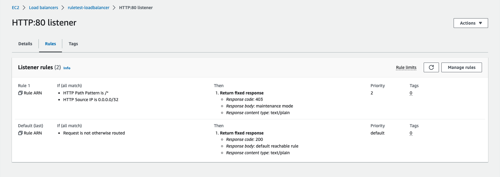

## 概要

ALBリスナールールを指定の時間で切り替えて、外部アクセスを制御する EventBridge と Lambda を登録するCloudFormation

- EventBridge
    指定の許可開始時間と許可終了時間で起動し、Lambdaを実行する
- Lambda
    指定のリスナールールを変更する

## 前提条件

- 変更対象のALBのリスナールールが登録されていること

## 使い方

### パラメータ json ファイルを作成する

### デプロイ

```
cd src
```

- ChangeSet を作成する

```bash
./apply_RuleScheduleLambda
```

- ChangeSet を適用する

```bash
./apply_RuleScheduleLambda deploy
```

## Resources

- EventBridgeSchedulerToggleAllowRule
- EventBridgeSchedulerToggleDenyRule
- IAMInlinePolicy001RoleEventBridgeScheduler
- IAMInlinePolicy001RoleRuleScheduleLambda
- LambdaRuleSchedule
- RoleEventBridgeScheduler
- RoleRuleScheduleLambda

## 確認

aws scheduler get-schedule --name eb-rule-kpd-dev2-toggle-listenerrule-allow
aws scheduler get-schedule --name eb-rule-kpd-dev2-toggle-listenerrule-deny

## lambda 実行

- 実行前



- 拒否設定

```bash
export SystemName=kpd
export Env=dev2
aws lambda invoke --function-name lmd-$SystemName-$Env-toggle-listenerrule \
--payload '{ "action": "deny" }' \
--cli-binary-format raw-in-base64-out response.json
```
```json
{
    "StatusCode": 200,
    "ExecutedVersion": "$LATEST"
}
```


- 許可設定

```bash
export SystemName=kpd
export Env=dev2
aws lambda invoke --function-name lmd-$SystemName-$Env-toggle-listenerrule \
--payload '{ "action": "allow" }' \
--cli-binary-format raw-in-base64-out response.json
```
```json
{
    "StatusCode": 200,
    "ExecutedVersion": "$LATEST"
}
```
